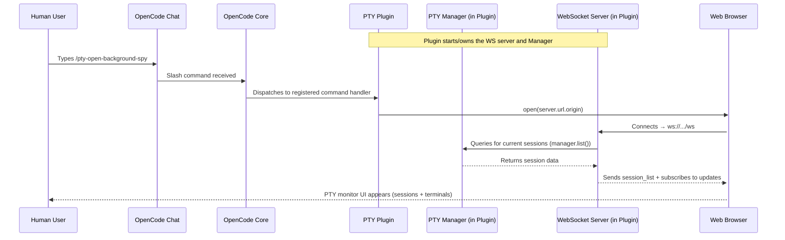
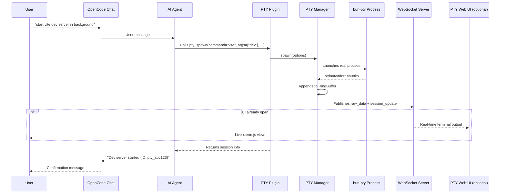
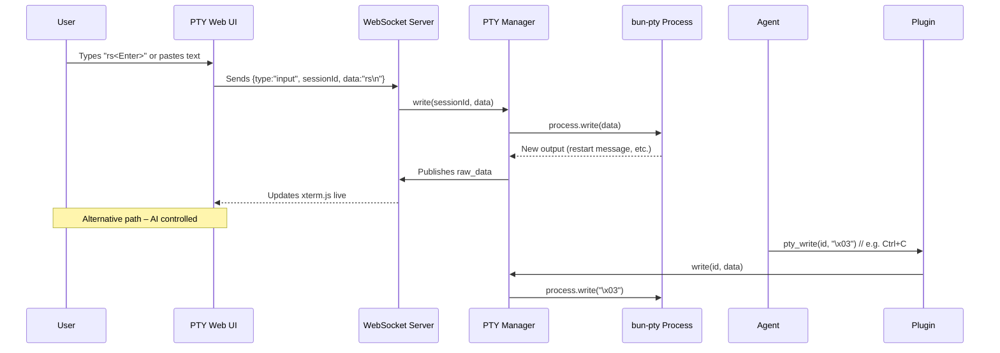
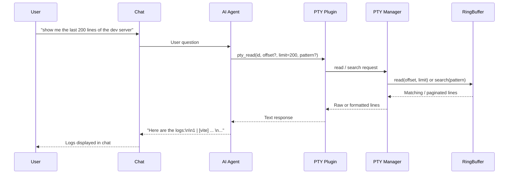
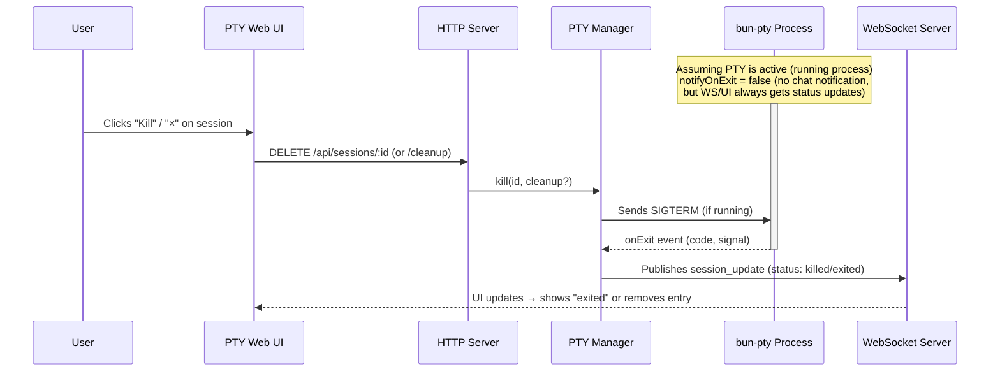
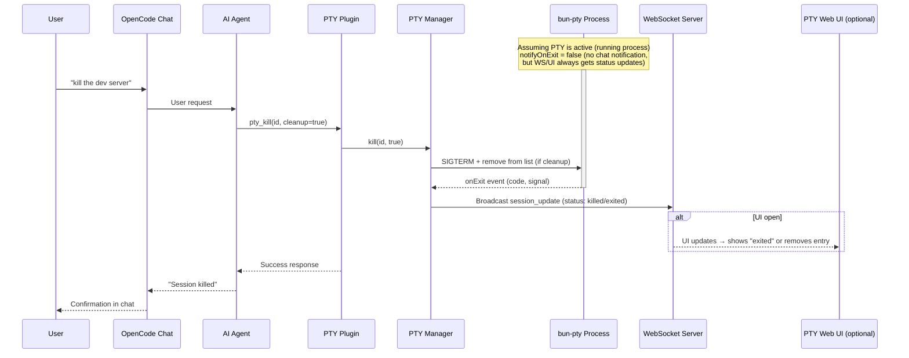
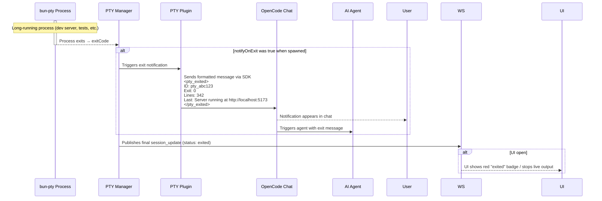

# opencode-pty

A plugin for [OpenCode](https://opencode.ai) that provides interactive PTY (pseudo-terminal) management, enabling the AI agent to run background processes, send interactive input, and read output on demand.

## Why?

OpenCode's built-in `bash` tool runs commands synchronously—the agent waits for completion. This works for quick commands, but not for:

- **Dev servers** (`npm run dev`, `cargo watch`)
- **Watch modes** (`npm test -- --watch`)
- **Long-running processes** (database servers, tunnels)
- **Interactive programs** (REPLs, prompts)

This plugin gives the agent full control over multiple terminal sessions, like tabs in a terminal app.

## Features

- **Background Execution**: Spawn processes that run independently
- **Multiple Sessions**: Manage multiple PTYs simultaneously
- **Interactive Input**: Send keystrokes, Ctrl+C, arrow keys, etc.
- **Output Buffer**: Read output anytime with pagination (offset/limit)
- **Pattern Filtering**: Search output using regex (like `grep`)
- **Exit Notifications**: Get notified when processes finish (eliminates polling)
- **Permission Support**: Respects OpenCode's bash permission settings
- **Session Lifecycle**: Sessions persist until explicitly killed
- **Auto-cleanup**: PTYs are cleaned up when OpenCode sessions end
- **Web UI**: Modern React-based interface for session management
- **Real-time Streaming**: WebSocket-based live output updates

## Setup

Add the plugin to your [OpenCode config](https://opencode.ai/docs/config/):

```json
{
  "$schema": "https://opencode.ai/config.json",
  "plugin": ["opencode-pty"]
}
```

That's it. OpenCode will automatically install the plugin on next run.

## Updating

> [!WARNING]
> OpenCode does NOT auto-update plugins.

To get the latest version, clear the cached plugin and let OpenCode reinstall it:

```bash
rm -rf ~/.cache/opencode/node_modules/opencode-pty
opencode
```

## Tools Provided

| Tool        | Description                                                                 |
| ----------- | --------------------------------------------------------------------------- |
| `pty_spawn` | Create a new PTY session (command, args, workdir, env, title, notifyOnExit) |
| `pty_write` | Send input to a PTY (text, escape sequences like `\x03` for Ctrl+C)         |
| `pty_read`  | Read output buffer with pagination and optional regex filtering             |
| `pty_list`  | List all PTY sessions with status, PID, line count                          |
| `pty_kill`  | Terminate a PTY, optionally cleanup the buffer                              |

## Slash Commands

This plugin provides slash commands that can be used in OpenCode chat:

| Command                    | Description                                        |
| -------------------------- | -------------------------------------------------- |
| `/pty-open-background-spy` | Open the PTY web server interface in the browser   |
| `/pty-show-server-url`     | Show the URL of the running PTY web server instance |

## Web UI

This plugin includes a modern React-based web interface for monitoring and interacting with PTY sessions.

[](https://youtu.be/wPqmTPnzvVY)

If you instruct the coding agent to run something in background, you have to name it "session",
i.e. "run xy as a background SESSION".
If you name it "task" or "process" or anything else, the agent will sometimes run it as background subprocess using `&`.

### Starting the Web UI

1. Run opencode with the plugin.
2. Run slash command `/pty-open-background-spy`.

This will start the background sessions observer cockpit server and launch the browser with web UI.

### Features

- **Session List**: View all active PTY sessions with status indicators
- **Real-time Output**: Live streaming of process output via WebSocket
- **Interactive Input**: Send commands and input to running processes
- **Session Management**: Kill sessions directly from the UI
- **Connection Status**: Visual indicator of WebSocket connection status

### REST API

The web server provides a REST API for session management:

| Method   | Endpoint                         | Description                                                                 |
| -------- | -------------------------------- | --------------------------------------------------------------------------- |
| `GET`    | `/api/sessions`                  | List all PTY sessions                                                       |
| `POST`   | `/api/sessions`                  | Create a new PTY session                                                    |
| `GET`    | `/api/sessions/:id`              | Get session details                                                         |
| `POST`   | `/api/sessions/:id/input`        | Send input to a session                                                     |
| `DELETE` | `/api/sessions/:id`              | Kill a session (without cleanup)                                            |
| `DELETE` | `/api/sessions/:id/cleanup`      | Kill and cleanup a session                                                  |
| `GET`    | `/api/sessions/:id/buffer/plain` | Get session output buffer (returns `{ plain: string, byteLength: number }`) |
| `GET`    | `/api/sessions/:id/buffer/raw`   | Get session output buffer (raw data)                                        |
| `DELETE` | `/api/sessions`                  | Clear all sessions                                                          |
| `GET`    | `/health`                        | Server health check with metrics                                            |

#### Session Creation

```bash
curl -X POST http://localhost:[PORT]/api/sessions \
  -H "Content-Type: application/json" \
  -d '{
    "command": "bash",
    "args": ["-c", "echo hello && sleep 10"],
    "description": "Test session"
  }'
```

Replace `[PORT]` with the actual port number shown in the server console output.

#### WebSocket Streaming

Connect to `/ws` for real-time updates:

```javascript
const ws = new WebSocket('ws://localhost:[PORT]/ws')

ws.onmessage = (event) => {
  const data = JSON.parse(event.data)
  if (data.type === 'raw_data') {
    console.log('New output:', data.rawData)
  } else if (data.type === 'session_list') {
    console.log('Session list:', data.sessions)
  }
}
```

Replace `[PORT]` with the actual port number shown in the browser when running the slash command output.

### Development

Future implementation will include:

#### App

- A startup script that runs the server (in the same process).
- The startup script will run `bun vite` with an environment variable set to the server URL
- The client will use this environment variable for WebSocket and HTTP requests

This will ease the development on the client.

## Usage Examples

### Start a dev server

```
pty_spawn: command="npm", args=["run", "dev"], title="Dev Server"
→ Returns: pty_a1b2c3d4
```

### Check server output

```
pty_read: id="pty_a1b2c3d4", limit=50
→ Shows last 50 lines of output
```

### Filter for errors

```
pty_read: id="pty_a1b2c3d4", pattern="error|ERROR", ignoreCase=true
→ Shows only lines matching the pattern
```

### Send Ctrl+C to stop

```
pty_write: id="pty_a1b2c3d4", data="\x03"
→ Sends interrupt signal
```

### Kill and cleanup

```
pty_kill: id="pty_a1b2c3d4", cleanup=true
→ Terminates process and frees buffer
```

### Run with exit notification

```
pty_spawn: command="npm", args=["run", "build"], title="Build", notifyOnExit=true
→ Returns: pty_a1b2c3d4
```

The AI agent will receive a notification when the build completes:

```xml
<pty_exited>
ID: pty_a1b2c3d4
Title: Build
Exit Code: 0
Output Lines: 42
Last Line: Build completed successfully.
</pty_exited>

Use pty_read to check the full output.
```

This eliminates the need for polling—perfect for long-running processes like builds, tests, or deployment scripts. If the process fails (non-zero exit code), the notification will suggest using `pty_read` with the `pattern` parameter to search for errors.

## Configuration

### Environment Variables

| Variable               | Default    | Description                                        |
| ---------------------- | ---------- | -------------------------------------------------- |
| `PTY_MAX_BUFFER_LINES` | `50000`    | Maximum lines to keep in output buffer per session |
| `PTY_WEB_HOSTNAME`     | `::1`      | Hostname for the web server to bind to             |

### Permissions

This plugin respects OpenCode's [permission settings](https://opencode.ai/docs/permissions/) for the `bash` tool. Commands spawned via `pty_spawn` are checked against your `permission.bash` configuration.

```json
{
  "$schema": "https://opencode.ai/config.json",
  "permission": {
    "bash": {
      "npm *": "allow",
      "git push": "deny",
      "terraform *": "deny"
    }
  }
}
```

> [!IMPORTANT]
> **Limitations compared to built-in bash tool:**
>
> - **"ask" permissions are treated as "deny"**: Since plugins cannot trigger OpenCode's permission prompt UI, commands matching an "ask" pattern will be denied. A toast notification will inform you when this happens. Configure explicit "allow" or "deny" for commands you want to use with PTY.
> - **"external_directory" with "ask" is treated as "allow"**: When the working directory is outside the project and `permission.external_directory` is set to "ask", this plugin allows it (with a log message). Set to "deny" explicitly if you want to block external directories.

#### Example: Allow specific commands for PTY

```json
{
  "$schema": "https://opencode.ai/config.json",
  "permission": {
    "bash": {
      "npm run dev": "allow",
      "npm run build": "allow",
      "npm test *": "allow",
      "cargo *": "allow",
      "python *": "allow"
    }
  }
}
```

## How It Works

1. **Spawn**: Creates a PTY using [bun-pty](https://github.com/nicksrandall/bun-pty), runs command in background
2. **Buffer**: Output is captured into a rolling line buffer (ring buffer)
3. **Read**: Agent can read buffer anytime with offset/limit pagination
4. **Filter**: Optional regex pattern filters lines before pagination
5. **Write**: Agent can send any input including escape sequences
6. **Lifecycle**: Sessions track status (running/exited/killed), persist until cleanup
7. **Notify**: When `notifyOnExit` is true, sends a message to the session when the process exits
8. **Web UI**: React frontend connects via WebSocket for real-time updates

## Session Lifecycle

```
spawn → running → [exited | killed]
                      ↓
              (stays in list until cleanup=true)
```

Sessions remain in the list after exit so the agent can:

- Read final output
- Check exit code
- Compare logs between runs

Use `pty_kill` with `cleanup=true` to remove completely.

## Local Development

```bash
git clone https://github.com/shekohex/opencode-pty.git
cd opencode-pty
bun ci          # install packages from bun.lock
bun lint        # Runs Biome linting checks
bun format      # Runs Biome formatting checks
bun typecheck   # Runs TypeScript type checking
bun build:dev   # Build the React app for development
bun unittest    # Runs the unit tests
bun test:e2e    # Runs the e2e tests
```

To load a local checkout in OpenCode:

```json
{
  "$schema": "https://opencode.ai/config.json",
  "plugin": ["file:///absolute/path/to/opencode-pty/index.ts"]
}
```

## Diagrams

### Sequence

#### Use Case 1 – Opening the PTY Monitor Web UI



#### Use Case 2 – Starting a Long-Running Background Process



#### Use Case 3 – Sending Interactive Input to a Running Session



#### Use Case 4 – Reading Output / Logs On Demand



#### Use Case 5A – Killing / Cleaning Up a Session via Web UI



#### Use Case 5B – Killing / Cleaning Up a Session via Agent



#### Use Case 6 – Automatic Exit Notification



## License

MIT

## Contributing

Contributions are welcome! Please open an issue or submit a PR.

## Credits

- [OpenCode](https://opencode.ai) - The AI coding assistant this plugin extends
- [bun-pty](https://github.com/nicksrandall/bun-pty) - Cross-platform PTY for Bun
